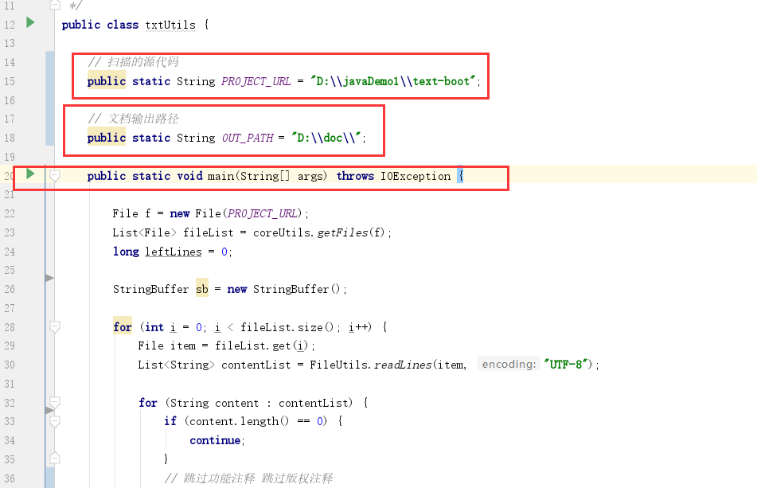

# yoci-gen-doc-rz

空余时间写的一个java版本 扫描源代码生成软著文档小项目

## docUtils v1.2

扫描源代码生成docx文档 v1.2版本，每一份3000行 60页 宋体 五号 .docx源代码

#### 生成流程 

1、递归扫描指定源代码 

2、通过将已经做好的docx模板，另存为xml文件，并修改xml文件为.ftl后缀的（freemaker）模板文件，（具体可以搜索freemaker生成word模板的方法）

3、将扫描的源代码填充至ftl模板文件，生成为doc源代码文档（本质其实还是xml文件，平均一份大约1.5M）

4、为了解决文档太大问题，采用jacob将doc（本质xml）转成docx后缀文件，最终文档一份50K左右

#### 使用方式 （两步）

第一步：（也可直接搜索jacob安装方式/使用方式）

（jacob，是个强依赖的项目，需要将我放在项目resource 的jacob-1.14.3-x64_jb51.net.rar解压，jacob-1.14.3-x64.dll放到本地安装jdk bin目录下即可）

第二步 v1.0版本一样，修改目录，直接启动项目

第三步 查看生成结果

## txtUtils v1.0

扫描源代码生成txt文档 v1.0版本，每一份大约3000行 60页左右

直接修改路径，启动main方法即可

#### 使用方式

